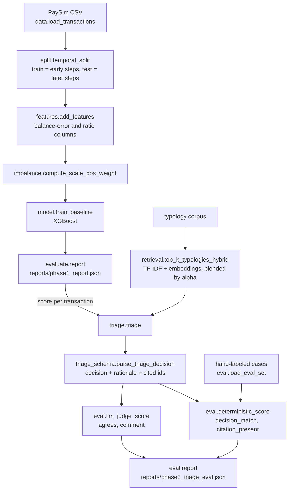

# Work log — aml-triage

Maintained by hand as the tutorial progresses. Last updated 2026-08-26.

## High-level summary

This project is an AML/fraud triage system built from scratch in three phases, following the plan in
`SEED.md`. Phase 1 is a classical gradient-boosted fraud classifier over PaySim mobile-money
transactions. Phase 2 is an agentic triage layer on top of it: retrieve relevant money-laundering
typologies, then have an LLM draft a structured triage recommendation (escalate / monitor / close)
with a cited rationale. Phase 3 is the eval harness that measures the triage layer.

Current state: Phase 1 is complete. `src/aml_triage/scripts/train_baseline.py` runs the full
pipeline end to end and wrote the Phase 1 deliverable to `reports/phase1_report.json`
(precision 0.906, recall 0.756, PR-AUC 0.884, threshold 0.571). Phase 2 is complete: retrieval
(`retrieval.py`), the structured decision contract (`triage_schema.py`), and the end-to-end agent
(`triage.py`) all exist. Phase 3 is complete: `eval.py` holds `load_eval_set`,
`deterministic_score`, the LLM judge (`JUDGE_TOOL_SCHEMA`, `_judge_prompt`, `llm_judge_score`), and
now `report`; the hand-labeled golden set (`data/triage_eval_set.jsonl`, 16 cases) exists; all
fifteen lessons are done.

Tech stack as it actually stands in `pyproject.toml`: Python >= 3.13, `uv` with the `uv_build`
backend, `pandas`, `scikit-learn`, `xgboost`, `sentence-transformers`, and `pytest` in the dev
dependency group. `anthropic` is now a runtime dependency too, pinned as `anthropic>=1.0.0`.

| Lesson | Produced | Status |
| --- | --- | --- |
| 001 | `pyproject.toml`, `src/aml_triage/` package layout, `tests/` | Complete |
| 002 | `data.py` — `load_transactions(path)` | Complete |
| 003 | `split.py` — `temporal_split(df, split_step)` | Complete |
| 004 | `features.py` — `add_features(df)` | Complete |
| 005 | `imbalance.py` — `compute_scale_pos_weight(y)` | Complete |
| 006 | `model.py` — `train_baseline(X_train, Y_train, weight)` | Complete |
| 007 | `evaluate.py` — `report(y_true, scores, objective)`, `reports/phase1_report.json` | Complete |
| 008 | `retrieval.py` — `top_k_typologies(...)` plus private helpers | Complete |
| 009 | `retrieval.py` — `top_k_typologies_hybrid(...)`, `_embedding_scores(...)` | Complete |
| 010 | `triage_schema.py` — `TRIAGE_TOOL_SCHEMA`, `build_prompt`, `parse_triage_decision` | Complete |
| 011 | `src/aml_triage/triage.py` — `triage(...)` | Complete |
| 012 | `eval.py` — `load_eval_set(path)`; `data/triage_eval_set.jsonl` (16 hand-labeled cases) | Complete |
| 013 | `eval.py` — `deterministic_score(case, result)` | Complete |
| 014 | `eval.py` — `JUDGE_TOOL_SCHEMA`, `_judge_prompt(result)`, `llm_judge_score(result, *, client=None)` | Complete |
| 015 | `eval.py` — `report(cases, results, deterministic_scores, judge_scores)` | Complete |

Next action: run the Phase 3 pipeline live (needs `ANTHROPIC_API_KEY`) to populate
`reports/phase3_triage_eval.json`, then read the disagreements case by case.

## System diagram

This is the whole pipeline as it now stands, Phase 1 feeding Phase 2 feeding Phase 3.

In plain text, for readers without a Mermaid renderer: PaySim CSV is loaded by
`data.load_transactions`, split by time in `split.temporal_split`, enriched by
`features.add_features`, weighted by `imbalance.compute_scale_pos_weight`, and used to train an
XGBoost model in `model.train_baseline`. `evaluate.report` writes `phase1_report.json` and supplies
a per-transaction score. That score plus typologies retrieved by
`retrieval.top_k_typologies_hybrid` feed `triage.triage`, whose output is parsed by
`triage_schema.parse_triage_decision` into a decision, rationale, and cited typology ids.
Hand-labeled cases from `eval.load_eval_set` plus that output feed `eval.deterministic_score`, while
the output alone feeds `eval.llm_judge_score`. Both score streams feed `eval.report`, which writes
`phase3_triage_eval.json`.

## Per-lesson log

## 001 — Project setup

### What I built

A `uv`-managed project rooted at `aml-triage/`: `pyproject.toml` declaring the package
`aml-triage` with the `uv_build` backend and `requires-python = ">=3.13"`, the package itself under
`src/aml_triage/` with `__init__.py` and `py.typed`, a `uv.lock` written by `uv`, and an empty
`tests/` directory at the repository root for my own scratch tests.

### Knowledge nuggets

- `pyproject.toml` states what the code needs; `uv.lock` pins the exact resolved versions down to
  the hash. The lock file is what makes "it works on my machine" a checkable claim rather than a
  promise — anyone running `uv sync` gets the same environment.
- Never hand-edit `uv.lock`. Its only correct source is `uv` actually resolving the dependency list.
- The `src/` layout means `import aml_triage` only succeeds once the package is genuinely installed
  into the environment. A flat `aml_triage/` next to `pyproject.toml` can import by accident just
  because a script ran from the repository root, which hides packaging bugs until they surface
  somewhere else.
- Getting the environment right first is a debugging strategy: if setup is broken, the failure
  appears in the next lesson disguised as a data problem.

### Checks

`uv run pytest ../aml-tutor/tests/001_test_project_setup.py` — Passed.

## 002 — Load and explore the data

### What I built

`src/aml_triage/data.py` with `EXPECTED_COLUMNS` and `load_transactions(path: str) -> pd.DataFrame`.
It reads the CSV, raises `ValueError` if any expected column is missing, and coerces dtypes
explicitly: `step` to `int64`, `amount` and the four balance columns to `float64`, `isFraud` and
`isFlaggedFraud` to `int16`. Returns the DataFrame. The sample itself lives at
`data/paysim_sample.csv` (200,000 rows drawn from the full Kaggle PaySim set with a fixed
`random_state`, and `data/` is gitignored because the file is large and derived).

### Knowledge nuggets

- At roughly 0.1% fraud prevalence, accuracy is meaningless: a model that always predicts "not
  fraud" scores above 99.8% while catching zero fraud. Accuracy is dominated by the majority class.
- Precision (of what was flagged, how much was real fraud) and recall (of real fraud, how much was
  flagged) cannot be gamed by the always-predict-majority trick — a never-fraud model has undefined
  precision and zero recall, so both numbers expose the failure accuracy hides.
- Coerce dtypes explicitly instead of trusting `pd.read_csv` inference. One stray blank makes pandas
  read a numeric column as `object`, and the arithmetic in every later lesson breaks silently.
- The `step` column is the worst case for this: as strings, `"9" <= "10"` is `False`, so the
  time-based split in 003 would still run but put rows on the wrong side of the boundary — a bug
  that looks like it lives in the split, not in loading.
- Fixing the sampling seed is what makes every downstream number reproducible.

### Checks

`uv run pytest ../aml-tutor/tests/002_test_data_loading.py` — Passed.

## 003 — Time-based split

### What I built

`src/aml_triage/split.py` with
`temporal_split(df: pd.DataFrame, split_step: int) -> tuple[pd.DataFrame, pd.DataFrame]`. Train is
every row with `step <= split_step`, test is every row with `step > split_step`, and both halves get
`.reset_index(drop=True)` before being returned as `(train_df, test_df)`. The real run in
`scripts/train_baseline.py` uses `split_step=355`.

### Knowledge nuggets

- A random shuffle split leaks the future into training: a model that learned from step 40 while
  being tested on step 10 has seen outcomes that did not exist at decision time. The inflated score
  only reveals itself after deployment, when it is expensive.
- `step` is PaySim's clock — hours since the simulation started, 1 through 743. Splitting on it
  mirrors the real deployment question: given only what was known up to a point in time, how well
  does the model do on what comes next?
- The tie rule is non-negotiable: a single `step` value is never divided across train and test. Two
  transactions in the same hour landing on opposite sides reintroduces exactly the same-moment
  leakage the split exists to prevent. This is why the two comparisons must be complements.
- Filtering keeps the original row labels, so both halves need `.reset_index(drop=True)` for later
  code that works positionally.
- `split_step` should be chosen from the sample's own step range and the train/test proportions
  wanted, not picked as an abstract constant.
- The split alone does not stop leakage: any windowed feature (rolling averages, running balances)
  must be derivable from its own split only, or it leaks across the boundary this lesson drew.

### Checks

`uv run pytest ../aml-tutor/tests/003_test_time_based_split.py` — Passed.

## 004 — Feature engineering

### What I built

`src/aml_triage/features.py` with `add_features(df: pd.DataFrame) -> pd.DataFrame`. It drops
`nameOrig`, `nameDest`, and `isFlaggedFraud`; derives
`orig_balance_delta = newbalanceOrig - oldbalanceOrg` and
`dest_balance_delta = newbalanceDest - oldbalanceDest`; derives the integer flags `is_transfer` and
`is_cash_out` from the `type` string column; then drops `type`. Returns the resulting numeric frame.

### Knowledge nuggets

- Every column that survives into training must encode information available at decision time, or it
  does not belong.
- `nameOrig` and `nameDest` are account identifiers. A model that memorizes which account IDs turned
  out fraudulent has memorized labels by another name — nothing about that transfers to an account
  it has never seen.
- `isFlaggedFraud` is a different failure: it is label-adjacent, a signal derived from the outcome
  being predicted. Keeping it invites the model to learn a near-copy of the target instead of the
  underlying transaction pattern.
- `type` is not leaky, just non-numeric. Its useful signal is preserved as two binary flags, because
  PaySim fraud concentrates in transfers and cash-outs.
- Deltas, not ratios: `newbalance / oldbalance` produces `0/0` (`NaN`) on the many rows where an
  account starts and ends at zero balance. `0 - 0 = 0` correctly says "no balance change." A `NaN`
  feature would not fail here — it would fail two lessons later inside an XGBoost error message.

### Checks

`uv run pytest ../aml-tutor/tests/004_test_feature_engineering.py` — Passed.

## 005 — Class imbalance

### What I built

`src/aml_triage/imbalance.py` with `compute_scale_pos_weight(y: pd.Series) -> float`. It counts
`(y == 1).sum()` and `(y == 0).sum()`, raises `ValueError` when there are no positive examples, and
otherwise returns `negative / positive`. `scripts/train_baseline.py` calls it on `train_df['isFraud']`
only.

### Knowledge nuggets

- `scale_pos_weight` changes what a wrong answer costs, not which rows the model sees. It multiplies
  the loss contribution of every positive row so the model can no longer minimize total loss by
  ignoring the rare class.
- The standard value is `count(negative) / count(positive)` on the training labels. Set it much
  higher and precision drops (more legitimate transactions flagged, more reviewer time on false
  alarms); leave it at the default of 1 and recall drops (real fraud stops clearing the threshold).
- The weight has to be computed on the train split only. Using the test split's class balance leaks
  information into training in exactly the same category as lesson 003's leak — it is knowable only
  because I already hold labels the model has not been evaluated against.
- The function cannot enforce which `Series` it is handed; that discipline lives in the calling code.
  No test in 005 or 006 would catch a weight computed on the wrong split — the model just trains
  slightly miscalibrated and looks fine.
- An all-negative input raises rather than returning `inf`, so a caller who passed the wrong column
  gets a loud, explained failure.

### Checks

`uv run pytest ../aml-tutor/tests/005_test_class_imbalance.py` — Passed.

## 006 — Train the baseline

### What I built

`src/aml_triage/model.py` with `train_baseline(X_train, Y_train, weight: float) -> xgb.XGBClassifier`.
It constructs `xgb.XGBClassifier(n_estimators=100, max_depth=4, learning_rate=0.1,
scale_pos_weight=weight, eval_metric="aucpr", random_state=42)`, calls `.fit(X_train, Y_train)`, and
returns the fitted model. It never touches the test split.

### Knowledge nuggets

- Gradient-boosted trees are the correct model here, not a placeholder. After `add_features` every
  row is already a handful of numeric and binary columns — the columns *are* the representation, so
  there is nothing for a neural network's representation learning to earn back its cost on.
- XGBoost fits this problem for two more reasons: `scale_pos_weight` is a first-class constructor
  argument (the library was built assuming this correction), and boosted trees stay inspectable via
  feature importances and tree splits — which matters when a human compliance reviewer has to
  justify a flag.
- `eval_metric="aucpr"` instead of the default `logloss`, because log-loss weights every row's error
  equally regardless of class — precisely the bias lesson 005 exists to counteract.
- `max_depth=4` keeps trees shallow enough to read and to resist overfitting; `random_state=42`
  means a score change between runs is a real change, not random variation.
- Passing the weight in as an argument (rather than baking it in as a feature) keeps training a
  consumer of the class-balance decision, not the place that makes it.
- A ROC-AUC above 0.5 proves almost nothing — ROC-AUC only measures relative ordering. A degenerate
  model clears that bar and only shows its damage when lesson 007 tries to pick an operating point.

### Checks

`uv run pytest ../aml-tutor/tests/006_test_train_baseline.py` — Passed.

## 007 — Evaluation and threshold

### What I built

`src/aml_triage/evaluate.py` with `report(y_true, scores, objective) -> dict`. It builds the full
curve with `precision_recall_curve`, computes `pr_auc` with `average_precision_score`, filters to
threshold indices where `precision[i] >= objective["min_precision"]`, raises `ValueError` if none
qualify, takes the qualifying index with the highest recall, and returns
`{"precision", "recall", "pr_auc", "threshold"}` as plain floats. `scripts/train_baseline.py` runs
the whole pipeline, scores the test split with `model.predict_proba(X_test)[:, 1]`, calls
`report(Y_test, scores, {"min_precision": 0.90})`, and writes the result to
`reports/phase1_report.json`: precision 0.9057, recall 0.7559, PR-AUC 0.8838, threshold 0.5709.

### Knowledge nuggets

- A fraud score is not a decision until something picks a threshold. Precision and recall move in
  opposite directions as the threshold moves — lower the bar and recall climbs while precision
  falls, raise it and the reverse.
- PR-AUC summarizes the whole trade-off curve in one threshold-independent number, and stays
  informative when positives are rare. ROC-AUC does not, because it is dominated by the vast
  majority class. PR-AUC tells me the curve is worth picking a point on; the chosen triple tells me
  what I actually get at one operating point. Neither substitutes for the other.
- The operating rule chosen here — maximize recall subject to precision >= 90% — is a business
  decision in mathematical clothing: a compliance team can absorb one false alarm in ten, but a
  missed fraud case has no floor under its cost.
- "Best F1" is the wrong rule for this problem: F1 weights precision and recall equally by
  construction, so it can land on a 70%-precision threshold no compliance program would accept. A
  precision floor is what encodes the tolerance F1 has no way to express.
- `precision_recall_curve` returns one more precision/recall point than it has thresholds (the final
  recall-0/precision-1 point has no threshold), so index selection must stay within
  `range(len(thresholds))`.
- Raise rather than silently degrade when no threshold clears the floor — same instinct as 005's
  zero-positives guard.
- The report on disk, not a variable that vanishes when the script ends, is the deliverable. Whether
  its recall is operationally acceptable is a judgment no test can make for me — and if it looks too
  low, the cause is almost always upstream (model, features, weight), not the threshold logic.

### Checks

`uv run pytest ../aml-tutor/tests/007_test_evaluation.py` — Passed.

## 008 — Typology retrieval

### What I built

`data/typologies.json` (the six-typology corpus) plus `src/aml_triage/retrieval.py` with
`top_k_typologies(query: str, k: int = 3, corpus_path: str | None = None) -> list[dict]`. It defaults
`corpus_path` to `"data/typologies.json"`, scores the corpus by TF-IDF cosine similarity, and returns
the top `k` results as `{"id", "title", "text", "score"}` dicts sorted by score descending. The
private helpers `_load_corpus(corpus_path)`, `_documents(corpus)` (joining each entry as
`"{title}. {text}"`), and `_tfidf_scores(query, documents)` are factored out for lesson 009 to reuse.

### Knowledge nuggets

- This is the retrieval half of RAG. An LLM alone knows only its training data; to make its output
  faithful to a specific domain corpus, you retrieve the relevant documents first and pass them in
  as context.
- TF-IDF plus cosine similarity is the right tool for a small fixed corpus: no model download, no
  cold start, no new dependency, and an exactly reproducible ranking — which matters for debugging
  and for compliance audits.
- It breaks down at scale: cost climbs with corpus size, and pure keyword matching misses semantic
  relationships (a query about "illegal transfer" should reach "money laundering" even with no
  shared words). That is the gap lesson 009 fills.
- The choice of `k` has downstream consequences: lesson 010 rejects any citation the model was not
  shown, so a `k` too small to include the matching typology turns a correct decision into a
  rejected one.

### Checks

`uv run pytest ../aml-tutor/tests/008_test_retrieval.py` — Passed.

## 009 — Hybrid retrieval

### What I built

Extended `src/aml_triage/retrieval.py` with
`top_k_typologies_hybrid(query: str, k: int = 3, corpus_path: str | None = None, alpha: float = 0.5) -> list[dict]`.
It reuses `_load_corpus`, `_documents`, and `_tfidf_scores`, adds `_embedding_scores(query, documents)`
using `all-MiniLM-L6-v2` via `sentence-transformers`, blends the two arrays as
`alpha * tfidf + (1 - alpha) * embedding`, and returns the top `k` in the same result shape as
`top_k_typologies`. `_get_embedding_model()` lazily loads the model once into the module-level
`_EMBEDDING_MODEL` global. `sentence-transformers` was added to `pyproject.toml`.

### Knowledge nuggets

- The two retrievers fail in opposite directions. TF-IDF nails exact compliance terms but misses
  paraphrase — "many small transfers to avoid detection" may not reach a document titled
  "Structuring / smurfing". Embeddings catch the paraphrase but can hallucinate similarity between
  things that are not the same compliance risk, like "avoiding currency controls" and "exchanging
  currency".
- Blending with a tunable `alpha` gets both behaviours from one score. `alpha=1.0` collapses exactly
  to pure TF-IDF (the embedding term is multiplied by zero), which is why that case is the
  deterministic one to test the blending arithmetic against; `alpha=0.0` is pure embeddings.
- The right `alpha` is empirical — a real deployment tunes it against labeled retrieval-quality
  data. A six-document teaching corpus cannot support that, so 0.5 here is a default, not a finding.
- Lazy-loading the model into a module global means the ~90MB download and initialization happen
  once, not on every call — which matters when a test suite exercises retrieval repeatedly.
- Embedding-based rankings shift slightly across model versions, so assertions about them should be
  soft (top-2, correct shape) rather than exact-order.

### Checks

`uv run pytest ../aml-tutor/tests/009_test_hybrid_retrieval.py` — Passed.

## 010 — Structured triage decisions

### What I built

`src/aml_triage/triage_schema.py` containing:

- `TRIAGE_TOOL_SCHEMA`, an Anthropic-shaped tool definition named `submit_triage_decision` whose
  input schema requires `decision` (enum: `escalate`, `monitor`, `close`), `rationale` (string), and
  `cited_typology_ids` (array of strings).
- `VALID_DECISIONS = {"escalate", "monitor", "close"}`.
- `build_prompt(transaction, classifier_score, retrieved) -> str`, a pure function rendering the
  transaction `type`/`amount`/`step`, the classifier score, and each retrieved typology's id, title,
  and text, ending with an explicit instruction to cite only IDs from that list.
- `parse_triage_decision(tool_input: dict, known_typology_ids: set) -> dict`, which raises
  `ValueError` on a decision outside the enum, raises `ValueError` listing any cited IDs not in
  `known_typology_ids`, and otherwise returns `tool_input` unchanged.

No LLM is called in this lesson.

### Knowledge nuggets

- Forcing structured output at the model boundary via a tool schema beats parsing free text. The
  schema is a JSON contract, it becomes part of the audit trail, and the model cannot bypass it.
- `known_typology_ids` means the IDs retrieved and shown on *this* call, not the whole corpus. A
  citation to a real typology that was never shown is rejected exactly like a fabricated one —
  because the model had no evidence for it either way.
- Validation must be deterministic code, not trust in the instruction. The prompt asking for correct
  behaviour and the parser enforcing it are two separate mechanisms, and only the second is
  auditable.
- The three-state enum is a contract with downstream systems (escalation queues, dashboards).
  Loosening it to admit a fourth value silently breaks every consumer that assumed three.
- These are unit tests over fixed data. The first real model call is lesson 011, and a failure there
  from an unknown citation is the guard doing its job.

### Checks

`uv run pytest ../aml-tutor/tests/010_test_structured_decisions.py -v` — Passed.

## 011 — The end-to-end triage agent

### What I built

`anthropic>=1.0.0` added to `pyproject.toml` as a runtime dependency, plus
`src/aml_triage/triage.py` with
`triage(transaction, classifier_score, *, client=None, k=3, corpus_path=None, alpha=0.5) -> dict`,
wiring retrieval → prompt → forced tool call → parsing. When `client is None` it imports `anthropic`
and constructs `anthropic.Anthropic()`; that `import anthropic` sits inside the `if client is None:`
branch, so it never executes when a client is injected. It then builds the query
`f"{transaction['type']} transaction of amount {transaction['amount']}"`, passes it to
`top_k_typologies_hybrid(query, k=k, corpus_path=corpus_path, alpha=alpha)` as `retrieved`, renders
`build_prompt(transaction, classifier_score, retrieved)`, and calls `client.messages.create(...)`
with `model=os.environ.get("TRIAGE_MODEL", "claude-haiku-4-5-20251001")`, `max_tokens=1024`,
`tools=[TRIAGE_TOOL_SCHEMA]`, `tool_choice={"type": "tool", "name": TRIAGE_TOOL_SCHEMA["name"]}`,
and a single user message carrying the prompt. It selects the tool-use block with
`next(block for block in response.content if block.type == "tool_use")`, builds
`known_ids = {item["id"] for item in retrieved}`, and returns
`dict(parse_triage_decision(tool_use.input, known_ids))` with a `"retrieved"` key added — a copy of
`parse_triage_decision`'s output rather than a mutation of it, so the returned dict carries
`decision`, `rationale`, `cited_typology_ids`, and `retrieved`.

### Knowledge nuggets

- The LLM client is an injected, testable seam. `client=None` with conditional construction means
  the test passes a fake returning predetermined output and production passes nothing and gets a
  live client — same interface, no mocking framework, no hidden global registry. This is the direct
  answer to "how do you test code that calls an LLM?".
- Because the fake client is injected, the test needs no `ANTHROPIC_API_KEY` and never reaches the
  real API.
- `tool_choice` forcing the specific tool is what guarantees schema-valid output instead of prose
  that has to be parsed.
- Carrying `"retrieved"` forward in the result is not decoration: later eval lessons need the exact
  set of typologies the model was shown to reproduce the conditions a decision was judged under.
  Copying before adding the key keeps `parse_triage_decision`'s return value unmutated.
- In a regulated setting this call would go through Bedrock or Azure OpenAI for the enterprise DPA
  and VPC boundary, and the output would be a draft routed to a human analyst queue — human-in-the-
  loop, never an auto-executed decision.
- A passing unit test with a fake client proves the wiring and the citation guard, not that real
  Claude output is sensible. That only comes from a live run.
- Because the `import anthropic` statement lives inside the `if client is None:` branch, it does not
  run during the tests at all — the module stays importable and usable by any caller that always
  injects a client, whether or not the SDK is even reachable.
- `known_ids` is built from `retrieved`, not from the full corpus, so a citation to a real typology
  that was simply never shown on this call is rejected exactly like a fabricated ID. A
  plausible-looking rationale resting on a document the model never read is the failure being
  guarded against.

### Checks

`uv run pytest ../aml-tutor/tests/011_test_triage_agent.py -v` — Passed, both
`test_triage_forces_the_structured_tool_and_returns_the_parsed_decision` and
`test_triage_raises_when_the_model_cites_something_it_was_not_shown`.

## 012 — The hand-labeled triage eval set

### What I built

`src/aml_triage/eval.py` with `load_eval_set(path)`, which opens a JSON-Lines file and returns
`[json.loads(line) for line in f if line.strip()]` — one dict per non-blank line. Plus
`data/triage_eval_set.jsonl`, my own golden set: the 16 candidates from
`../aml-tutor/tests/fixtures/triage_eval_candidates.jsonl`, each carrying its original `transaction`
and `classifier_score` plus two fields I wrote myself, `label_decision` (escalate / monitor / close)
and `label_note` (one sentence naming the fields that drove the call). Final distribution: 8
escalate, 4 monitor, 4 close. Unlike every other lesson, the deliverable here is the judgment, not
the code — the tutorial has no doer fallback for the labels, because invented labels would just be
more synthetic data.

### Knowledge nuggets

- The `classifier_score` in the candidate pool is not model output. It is hardcoded
  `0.95 if is_fraud else 0.05` by the fixture-building script, so it is PaySim's own `isFraud` flag
  rewritten as a number. It has exactly two distinct values across the file, carries no information
  about severity, and deferring to it would mean copying the answer key rather than reading the
  transaction.
- A destination balance that fails to move is a generation artifact, not a laundering signal. Real
  laundering typologies are behavioural (structuring, layering, pass-through); a ledger that does not
  reconcile is a data-integrity ticket. In PaySim it is worse than merely unrelated — it correlates
  with `isFraud`, which is part of why models on this dataset score well and do not transfer.
- The arithmetic proves it runs backwards: candidate row 7 (flagged, 0.95) reconciles to the cent
  (2,122,336.55 + 202,978.65 = 2,325,315.20 vs 2,325,315.19), while rows 9 and 11 (unflagged, 0.05)
  are off by 4,222 and 34,472 respectively.
- `oldbalanceOrg: 0.0` generally means *not recorded*, not *actually zero*. Rows 9 and 11 share that
  pattern and are unflagged, so the zero itself carries no fraud signal.
- `PAYMENT` rows go to `M...` merchant accounts, whose balances PaySim never tracks at all — which is
  why every payment in the pool shows destination `0.0 → 0.0`. `CASH_OUT` goes to a `C...` customer
  account: in mobile money, cashing out means handing credit to an agent who is themselves an account
  holder, so that destination has a real tracked balance.
- The raw data shows PaySim's fraud script directly: a `TRANSFER` and a `CASH_OUT` of the identical
  amount at the same `step`, both flagged — move funds to a controlled account, then cash the same
  sum out. That is genuine layering, but seeing it needs `nameOrig`/`nameDest` to link the two rows,
  and `add_features` drops both. So neither the model nor these labels can see it.
- The labeling rule I settled on: when the origin balance cannot account for the amount, discard that
  column as unreliable and judge on what remains. Two corroborating signals is `escalate` (row 1:
  amount equals `oldbalanceOrg` to the cent leaving zero, AND a previously empty destination receives
  exactly that sum). One surviving signal plus a data-quality problem is `monitor` (row 15: 40,182
  cannot fund a 1.34M transfer).
- `monitor` means the deciding evidence is not in this row. A single large cash-out emptying an
  account is unremarkable if the customer was closing it and a structuring pattern if it repeats four
  times next week; one transaction cannot distinguish those. That is exactly the call a script cannot
  make, which is why the labels have to be hand-written.
- Writing the notes down surfaced three inconsistencies invisible until they sat side by side: rows 9
  and 11 carrying opposite decisions on identical field patterns; row 13 marked `monitor` for
  "draining" an account it took 0.7% of; and row 15's decision reading `escalate` while its own note
  said the case was not actionable.
- That last one is the dangerous shape. Lesson 013 compares `label_decision` only — nothing reads the
  note at comparison time — so a note that argues for `monitor` beside a decision of `escalate`
  silently counts as a disagreement with an agent that reasoned exactly as I did. Inconsistent labels
  surface downstream looking like an agent bug.
- Intra-rater consistency is the whole game here. A real model-risk review has multiple SMEs label
  overlapping subsets and checks their agreement before trusting the set at all; I am both the SME
  and the reviewer, so the discipline has to be self-imposed.
- 16 cases is a floor, not SEED.md's 30–50 target. At this size the agreement rate in lesson 015
  moves 6 percentage points every time a single case flips.

### Checks

`uv run pytest ../aml-tutor/tests/012_test_eval_set.py -v` — Passed, all five: row count, exact key
set, allowed decision values, more than one decision type used, and non-blank notes. The tests check
structure only; whether the judgments are good was checked in conversation against the transaction
fields.

## 013 — Deterministic triage checks

### What I built

`deterministic_score(case, result)` added to `src/aml_triage/eval.py`, below `load_eval_set`. It
takes one row of my hand-labeled eval set as `case` and one return value of `triage(...)` as
`result`, and returns two booleans:
`{"decision_match": result["decision"] == case["label_decision"], "citation_present": len(result["cited_typology_ids"]) > 0}`.
No I/O, no model call, nothing to configure. Nothing calls it yet — the loop over the eval set is
lesson 015's job; for now the only caller is the baked-in test.

### Knowledge nuggets

- The two argument shapes are deliberately asymmetric: `case` carries `label_decision` (my call, from
  `data/triage_eval_set.jsonl`) and `result` carries `decision` (the agent's call, from `triage`).
  Confusing the two would produce a function that always reports agreement.
- The three citation checks live in three different places and fail three different ways. Does the id
  exist and was it shown? — `parse_triage_decision`, at generation time, raises `ValueError`. Was
  anything cited at all? — `deterministic_score`, recorded as `False`. Was the citation actually
  relevant? — the LLM judge in 014, scored by a model.
- Because the validity guard raises inside `triage(...)`, a result with a fabricated or unshown
  citation never becomes a return value. By the time anything reaches `deterministic_score`, an
  invalid citation is structurally impossible, not merely unlikely — there is nothing left to check.
  Checking validity here instead would mean accumulating a corpus of results containing fabricated
  citations plus a number saying how often that happened.
- `citation_present == False` is the one failure a relevance judge structurally cannot express: with
  an empty citation list, "is this citation relevant?" has no subject, and a judge shown only a
  rationale may well score fluent prose well. It is worth short-circuiting on — there is nothing to
  judge.
- `decision_match == False` is the opposite: it is the case most worth reading, not least. The same
  `False` is produced by the agent missing something I saw, by me missing something the agent saw,
  and by my own label being inconsistent — and I already found three inconsistencies in my own file
  in 012. Skipping the judge on mismatches would discard every informative case.
- `deterministic_score` does not validate my labels. It takes `label_decision` as given and reports
  whether the agent's decision equals it, which is exactly why the consistency work in 012 mattered.
- It scores one case, not the set. Two booleans about a single row; turning sixteen of those into an
  agreement rate is aggregation, and that is lesson 015.
- The split exists for cost. Running the eval means one live `triage` call per case; the deterministic
  checks add nothing on top of what that call already returned, while the 014 judge adds a second
  model call per case. Cheap checks first.
- The pressure test this cannot catch: an agent that always returns `{"decision": "monitor",
  "cited_typology_ids": ["TY-001"]}` without reading the transaction passes `citation_present` every
  time. That is precisely what 014 is for.

### Checks

`uv run pytest ../aml-tutor/tests/013_test_deterministic_checks.py -v` — Passed, all three:
`decision_match` true when decisions agree, false when they disagree, and `citation_present` false
when `cited_typology_ids` is empty.

## 014 — LLM-as-judge scoring

### What I built

Three additions to `src/aml_triage/eval.py`, plus `import os` at the top:

- `JUDGE_TOOL_SCHEMA`, an Anthropic-shaped tool named `submit_judge_verdict` requiring exactly two
  fields, `agrees` (boolean) and `comment` (string).
- `_judge_prompt(result)`, a pure function rendering the agent's decision, its rationale, the ids it
  cited, and the id/title/text of every retrieved typology, ending with "Does the rationale plausibly
  follow from the cited typology text?".
- `llm_judge_score(result, *, client=None)`, which constructs `anthropic.Anthropic()` only when no
  client is injected, calls `client.messages.create(...)` with `max_tokens=512`,
  `tools=[JUDGE_TOOL_SCHEMA]` and `tool_choice` naming that tool, pulls the `tool_use` block out of
  `response.content`, and returns `{"agrees": ..., "comment": ...}`.

### Knowledge nuggets

- The judge answers a narrow question: does this rationale follow from the text of the typology it
  cites? It is a consistency check between a claim and its evidence, not a check on whether the
  agent picked the right typology and not a check on whether the decision was correct.
- `_judge_prompt` does not include the transaction. No `amount`, no `type`, no balances — so the
  judge structurally cannot tell whether a typology applies to the row being triaged. It can only
  catch a contradiction visible from the rationale and the typology text alone, such as citing
  Structuring (many small transactions under a threshold) while writing "a single large withdrawal".
- Therefore `agrees: True` does not mean the decision was right. An agent that misreads a typology
  the same way on every case scores `agrees: True` every time, and only the hand-labeled decisions
  from 012 expose it. Supplementary signal, not foundational — the SR 11-7 artifact is the SME-labeled
  golden set.
- The prompt renders *every* retrieved typology, not only the cited ones, so the judge can see that a
  better-fitting document was sitting there unused. Feeding it only the cited text would hide exactly
  that failure.
- The two scorers differ in reach, not just in signature. `deterministic_score(case, result)` needs a
  human label, so it can only ever run on the 16-row eval set. `llm_judge_score(result)` needs only a
  triage result, so it could score live production traffic where nothing is labeled — a weaker signal
  per case that never runs out. That is what "ongoing monitoring" means here.
- No separate `retrieved=` parameter, deliberately. `retrieved` is the exact document set the agent
  saw on that call; reproducing it later would mean re-running hybrid retrieval with the same query,
  `k`, `corpus_path` and `alpha`, and the embedding half shifts across model versions anyway. A
  separate parameter would create a path where the judge scores a rationale against documents the
  agent never saw and returns a confident verdict on a comparison that never happened — worse than no
  signal, because it looks like a real one. Reading `result["retrieved"]` makes the result
  self-contained: it can be written to disk, moved, and judged later with no substitution possible.
- No validation step, unlike `triage`. `parse_triage_decision` exists because a fabricated citation is
  checkable against a known set; a boolean and a free-text comment are not checkable against anything,
  so there is nothing to guard.
- Python notes picked up here: a bare `*` in a signature makes everything after it keyword-only, which
  is why `llm_judge_score(result, fake)` is a `TypeError` — positional for what the function is about,
  keyword-only for how it runs. A leading underscore marks a name as internal (only `import *`
  enforces it); `_judge_prompt` is underscored because nothing outside the module should depend on it,
  while the baked-in test calling it directly is normal — tests reach into internals by design.
- `response.content` is a list of blocks, because a reply can contain narration text and a tool call.
  `next(block for block in response.content if block.type == "tool_use")` takes the first tool block
  and raises `StopIteration` if there is none — which `tool_choice` forcing the tool makes
  effectively impossible.

### Checks

`uv run pytest ../aml-tutor/tests/014_test_llm_judge.py -v` — Passed, both
`test_judge_forces_a_structured_tool_and_returns_its_verdict` and
`test_judge_prompt_includes_the_rationale_and_cited_typology_text`. The tests prove wiring and
parsing, not judge accuracy.

## 015 — The agreement-rate report

### What I built

`report(cases, results, deterministic_scores, judge_scores)` added to `src/aml_triage/eval.py`. It
takes four parallel lists — index `i` is the same case in each — builds
`lengths = {len(cases), len(results), len(deterministic_scores), len(judge_scores)}` and raises
`ValueError` showing that set if it does not have exactly one element, raises `ValueError` when
`n == 0`, and otherwise returns a dict with `n_cases`, `decision_agreement_rate` (the fraction of
cases where `deterministic_scores[i]["decision_match"]` is True), `citation_present_rate` (the
fraction where `citation_present` is True), and `judge_agreement_rate` (the fraction where
`judge_scores[i]["agrees"]` is True). Pure aggregation: no I/O, no model calls. The live pipeline
run that writes `reports/phase3_triage_eval.json` is not part of the test suite and has not been run
yet — it needs a real `ANTHROPIC_API_KEY`.

### Knowledge nuggets

- Three separate rates rather than one blended score, because each points at a different upstream
  owner: a low `decision_agreement_rate` is a classifier or decision-prompt problem, a low
  `citation_present_rate` is a tool-use problem, a low `judge_agreement_rate` is a grounding problem.
  Averaging them lets a good rate hide a bad one — 14/16 decisions right alongside 5/16 with no
  citation blends to roughly 0.78, a number describing neither fact.
- A missing citation is not just a metric dip: it is a case the human reviewer cannot check the
  recommendation against, so a right decision with no cited typology is still not an approvable
  draft.
- The diagnostic pattern worth naming: `judge_agreement_rate` low (0.3) with
  `decision_agreement_rate` high (0.9) means the citations and the prose are not connected — the
  model retrieves typologies, writes a rationale that would read the same with any typologies
  attached, and reaches the right answer anyway because a lot of PaySim rows are legible from the
  amount alone. Judgment fine, explanation fluent, link decorative. Invisible in the headline number
  a stakeholder would quote.
- Putting the four lengths in a set is the length check: agreement means exactly one element, and the
  error message shows every length seen, which is what I want when an upstream `zip()` silently
  truncated a list.
- `sum()` over booleans works because `True` is `1`, so each `sum(...) / n` is a fraction directly.
- The `n == 0` guard is not only about `ZeroDivisionError`. A report over zero cases is a number with
  nothing behind it, and raising is the same instinct as 005's zero-positives guard and 007's
  no-qualifying-threshold guard.
- The rate is only defensible because the labels are mine (012). An agreement rate against generated
  labels measures agreement with a generator.
- The aggregate is the start of the validation conversation, not the end. 0.7 could be uniform, or
  near-perfect on obvious cases and near-random on the hard ones; only reading the individual
  disagreements distinguishes those. At n=16 a single flipped case moves the rate 6 points.
- What a regulated shop would add: version the report against a specific model and prompt version,
  re-run it on a refreshed golden set on a schedule, and stratify the set by decision type and
  transaction family with SME review — rather than generating it once.

### Checks

`uv run pytest ../aml-tutor/tests/015_test_agreement_report.py -v` — Passed, both
`test_report_computes_the_three_rates` and `test_report_raises_on_mismatched_list_lengths`.

## Open threads

- The live Phase 3 run that populates `reports/phase3_triage_eval.json` has not happened yet: it
  needs `ANTHROPIC_API_KEY` and makes two model calls per case (one `triage`, one judge), and until
  it runs there is no measured agreement number to cite.
- Optional and non-graded: the manual pressure test from spec 011 — export `ANTHROPIC_API_KEY`, pick
  a transaction the Phase 1 classifier actually flagged, call `triage(...)` without `client=` against
  the live API, and read the decision, rationale, and citations to calibrate whether the model is
  being useful or hallucinating.
- Keep labeling beyond the 16-case floor toward SEED.md's 30–50 target, applying the same
  origin-balance rule to each new case; the agreement rate in lesson 015 only means something at
  larger n.
- Cosmetic: candidate row 16's `label_note` has a typo, "ammount".
